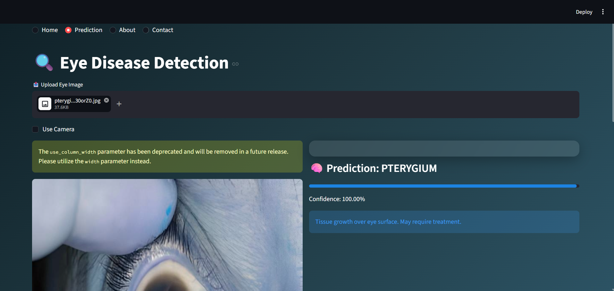
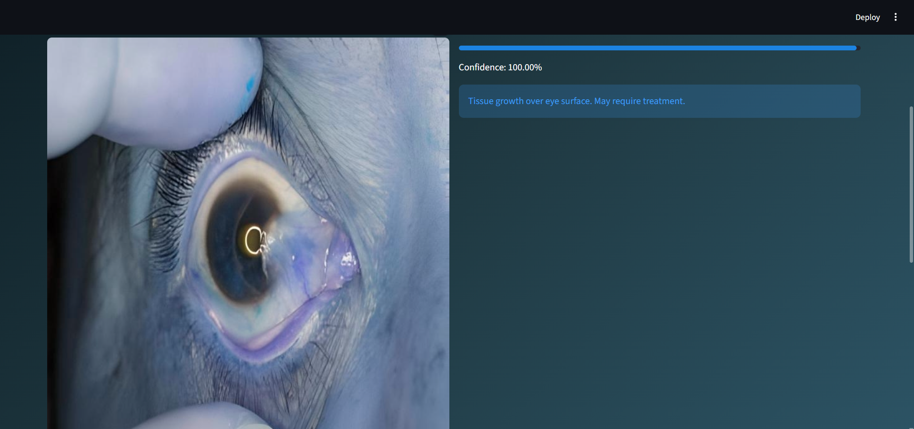
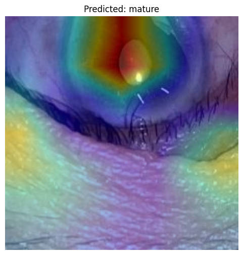
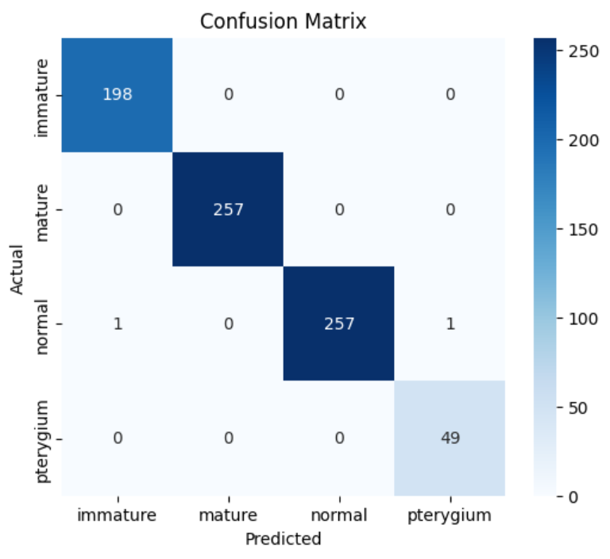
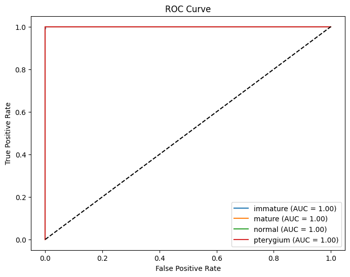
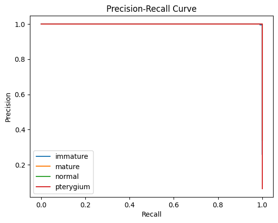
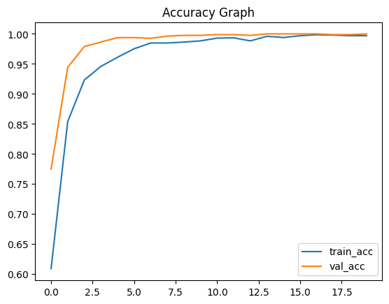
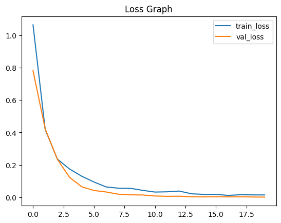

# 👓 Smart Eye Diagnosis using AI/ML

An intelligent real-time eye disease detection system using Deep Learning and deployed on edge devices like Raspberry Pi.

---

## 🚀 Features

* 🔍 Detects eye conditions:

  * Mature Cataract
  * Immature Cataract
  * Normal Eye
  * Pterygium
* 📷 Real-time detection using webcam / Raspberry Pi camera
* ⚡ Lightweight deployment using TensorFlow Lite
* 🔥 Explainable AI using Grad-CAM
* 🌐 Interactive UI using Streamlit

---

## 🧠 Model Details

* Model: EfficientNetB0
* Framework: TensorFlow / Keras
* Input Size: 224 × 224
* Classes: 4 (immature, mature, normal, pterygium)
* Deployment: TensorFlow Lite (Edge AI)

---

## 📊 Results

* ✅ High accuracy (~99%)
* ✅ Real-time inference
* ✅ Robust classification across multiple eye conditions

---

## 📸 Project Screenshots

### 🖥️ User Interface




---

### 🔥 Grad-CAM Visualization



---

### 📊 Confusion Matrix



---

### 📈 ROC Curve



---

### 📉 Precision vs Recall



---

### 📊 Accuracy Graph



---

### 📉 Loss Graph



---

## ⚙️ How to Run

```bash
git clone https://github.com/vedang2504/smart-eye-diagnosis
cd smart-eye-diagnosis
pip install -r requirements.txt
streamlit run app/streamlit_app.py
```

---

## 📦 Model Download

Due to size limitations, the trained model is hosted externally:

👉 (Paste your Google Drive link here)

---

## 🧩 Project Structure

```
smart-eye-diagnosis/
├── app/              # Streamlit app
├── src/              # Prediction logic
├── data/             # Dataset (not uploaded)
├── models/           # Trained models
├── notebooks/        # Training notebooks
├── assets/           # Screenshots
└── README.md
```

---

## 🧠 System Workflow

Camera → Image Capture → Preprocessing → TFLite Model → Prediction → Display Output

---

## 📌 Future Enhancements

* 🔊 Voice feedback system
* 📱 Mobile app integration
* ☁️ Cloud deployment
* ⚡ Faster edge optimization

---

## 👨‍💻 Author

Vedang Doley

---

## 📄 License

This project is for educational and research purposes.
